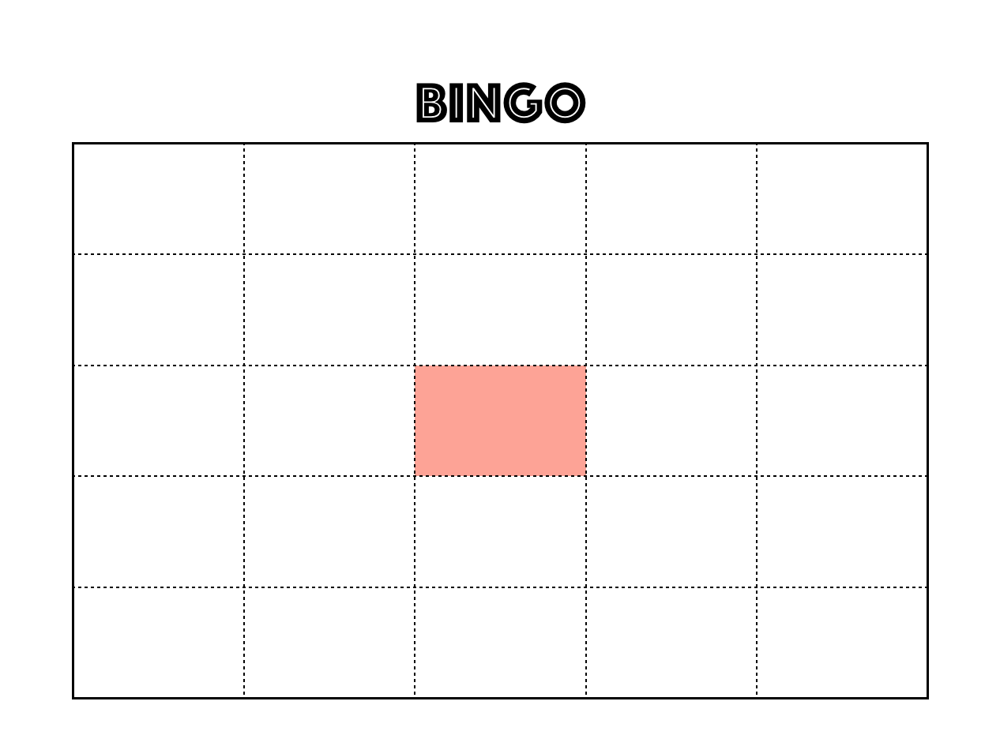

# Name bingo creator

## requirements
- member list

```python
member_group1 = [
    "member1",
    "member2",
    "member3"
]
member_group2 = [
    "member1",
    "member2",
    "member3"
]
# like so
```

- Bingo card image



- python3

## notice

- If you use Japanese, please download Japanese font like [IPAfont](https://ipafont.ipa.go.jp/node26#jp) and put the `.ttf` file at the directory.